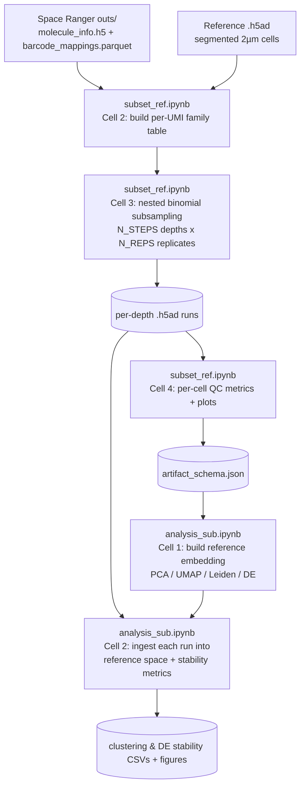

# SpatialSatCheck

## Visium HD (2 µm) binomial subsampling & sequencing-depth metrics

This repository emulates lower sequencing depth on **segmented Visium HD (2 µm)** spatial transcriptomics data by binomially thinning real molecule/UMI evidence from **10x Genomics Space Ranger** outputs, then tracks how clustering, differential expression, and per-cell QC change as a function of depth. It answers the practical question *"how much sequencing depth do I actually need for this tissue/assay?"* by simulating shallower runs from one deep run, rather than requiring multiple real sequencing runs at different depths.

The analysis is split across two notebooks that hand off to each other via a small JSON schema:

| Notebook | Job | Reads | Writes |
|---|---|---|---|
| `subset_ref.ipynb` | Build per-UMI evidence table from raw molecule data, do nested replicate-aware binomial subsampling across a depth grid, compute per-cell QC | `molecule_info.h5`, `barcode_mappings.parquet`, reference `.h5ad` | per-depth `.h5ad` runs, QC CSVs/plots, `artifact_schema.json` |
| `analysis_sub.ipynb` | Project every subsampled run into a shared reference embedding and quantify how stable clustering/DE/markers are at each depth | `artifact_schema.json` from `subset_ref.ipynb` | stability metric CSVs, figures, updated `.h5ad` runs |



## Why binomial subsampling

Re-sequencing the same library at several depths is expensive and slow. Instead, this pipeline thins the *reads supporting each UMI* from one deep run using a binomial draw, which reproduces the same depth-vs-saturation relationship you'd see from an actual shallower sequencing run. Subsampling is done **read-level, gene-aware, and nested**: each replicate draws depths from coarse to fine using a chained binomial ladder, so the deepest draw for a replicate is a strict superset of its shallower draws (consistent depth trajectories rather than independent random subsets at each depth).

## Stage 1 — `subset_ref.ipynb`

**Inputs** (edit the `CONFIG` block in Cell 1):
- A Space Ranger `outs/` directory containing `molecule_info.h5` and `barcode_mappings.parquet` (2 µm square → segmented cell mapping; Space Ranger v4+).
- A reference `.h5ad` of the segmented 2 µm cells, used to fix cell/gene identity and metadata across all subsampled runs.

**Steps:**
1. **Cell 1 — Config & reference load.** Paths, chunking/threading knobs, and a sanity-checked load of the reference AnnData.
2. **Cell 2 — Family table.** Streams `molecule_info.h5` in chunks, maps each 2 µm barcode to its segmented cell via the mapping parquet, maps each molecule's feature to the reference's gene index (Ensembl ID preferred, gene symbol as fallback), and writes a per-UMI "family" table (`cell_idx, gene_idx, umi_reads`) to parquet shards.
3. **Cell 3 — Nested replicate subsampling.** Computes a feasible reads-per-cell (RPC) grid (`N_STEPS` points up to the deepest achievable RPC), and for `N_REPS` replicates, nested-binomial-thins reads at each depth, rebuilding the count matrix and writing one `.h5ad` per `(target_rpc, replicate)` with per-cell reads/UMIs/saturation stored in `.obs`.
4. **Cell 4 — QC & handoff schema.** Computes per-cell QC (median/mean reads, UMIs, genes, saturation) per run, aggregates mean±SD across replicates, saves per-replicate and aggregated CSVs plus summary plots, and writes `artifact_schema.json` — the file `analysis_sub.ipynb` reads to find everything produced here.

**Key outputs** (under `<analysis_dir>/<sample_name>/`):
- `runs_rpc_clamped/subsample_MAPPED_rpc<N>_r<rep>.h5ad` — one count matrix per depth × replicate
- `runs_rpc_clamped/subsample_runs_index.csv` — index of all runs (target_rpc, rep, h5ad path, p_keep)
- `metrics_rpc_clamped/metrics_rpc_clamped_perrep.csv`, `..._agg.csv` — QC metrics per replicate and aggregated
- `metrics_rpc_clamped/panel_medians_vs_total_reads.png`, `panel_means_vs_total_reads.png` — QC trend plots
- `metrics_rpc_clamped/artifact_schema.json` — handoff manifest for Stage 2

## Stage 2 — `analysis_sub.ipynb`

**Inputs:** `artifact_schema.json` from Stage 1 (set `SCHEMA_JSON`/`ANALYSIS_ROOT` in the config cells to match).

**Steps:**
1. **Cell 1 — Reference embedding.** Loads the deepest available run as the reference, computes HVGs, PCA, neighbors, UMAP, and Leiden clustering once, runs reference DE (Wilcoxon, one cluster vs. rest), and writes an analysis schema pointing Cell 2 at all of this.
2. **Cell 2 — Per-depth stability metrics.** For every subsampled run: aligns genes to the reference by stable ID, projects the run into the reference's PCA space with `scanpy.ingest`, rebuilds its neighbor graph/UMAP/Leiden clusters, and computes how much clustering and DE structure survived depth reduction:
   - **ARI** and **NMI** (reference vs. depth-run Leiden labels)
   - **Hungarian-matched cluster accuracy** (best one-to-one cluster correspondence)
   - **kNN graph Jaccard overlap** (how much of each cell's neighborhood is preserved)
   - **DE top-20 Jaccard** and **DE log2FC Spearman correlation** (per matched cluster, vs. reference DE)
   
   It also saves the projected embeddings/labels back into each run's `.h5ad`, produces a 6-panel stability figure, a compact DE-only panel, and a shared-axis UMAP grid across all depths. Optionally (`DO_CAR_ANALYSIS`), it tracks a marker gene's top co-DE genes' log2FC and significance across depth — useful for confirming a specific population's signal (e.g. CAR+ cells) survives downsampling.

**Key outputs** (under `<ANALYSIS_ROOT>/`):
- `reference_with_embedding.h5ad` — the fitted reference (PCA/UMAP/Leiden/DE)
- `clustering_stability_metrics.csv`, `deg_stability_metrics.csv` — per-run stability metrics
- `figures/stability_vs_reads.png`, `de_metrics_panel.png`, `umap_grid.png` — depth-trend figures
- `car_deg_traces.csv` / `car_deg_traces_padj.csv` + figures — optional marker-gene DE trajectory (if enabled)

## Replicates

Stage 1 produces `N_REPS` independent replicate subsamples per depth (default 3), giving Stage 2's plots a scatter of points at each depth rather than a single averaged value — this shows subsampling variance directly rather than hiding it. If you'd rather see one averaged point per depth in Stage 2's figures, aggregate `clustering_stability_metrics.csv` by `target_rpc` (mean ± SD) before plotting.

## Installation (conda)

A `requirements.txt` file is provided. Create and activate a conda environment, then install the requirements inside it:

```bash
conda create -n visiumhd-subsample --file requirements.txt
conda activate visiumhd-subsample
```

## Quickstart

1. Open `subset_ref.ipynb`, edit the `CONFIG` block in Cell 1 (Space Ranger `outs/` dir, reference `.h5ad`, output directory), and run Cells 1–4 top to bottom.
2. Note the `artifact_schema.json` path printed at the end of Cell 4.
3. Open `analysis_sub.ipynb`, paste that path into `SCHEMA_JSON` (and matching `ANALYSIS_ROOT`) in Cell 1, and run Cells 1–2.
4. Inspect the stability/QC CSVs and figures to choose the minimum sequencing depth that keeps the metrics you care about acceptably stable.
